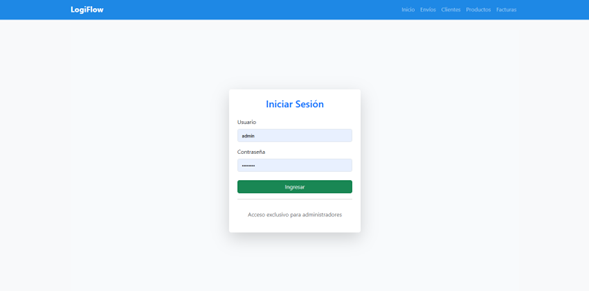
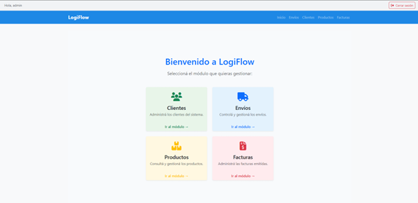
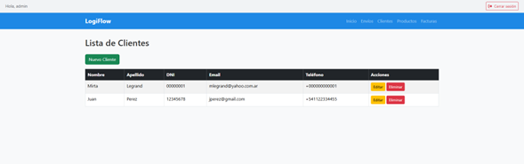
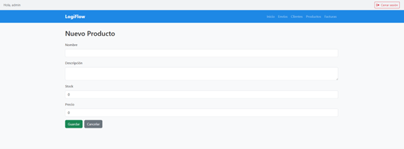
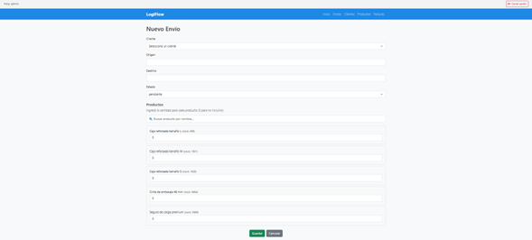
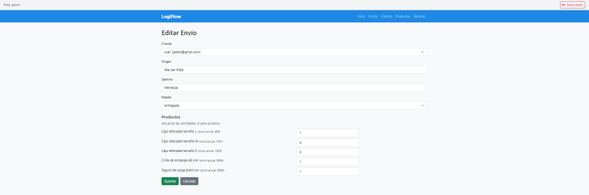
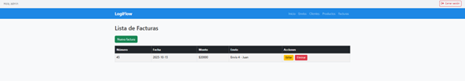

# LogiFlow - Backend

Sistema de Gestión Logística (Clientes, Productos, Envíos y Facturación)  
Proyecto desarrollado para el 3° Parcial – IFST 29 – Backend con Node.js y Express

---

## Descripción General

LogiFlow es un sistema de gestión logística completo que permite administrar:

- Clientes
- Productos
- Envíos asociando productos y descontando stock automáticamente
- Facturación vinculada a cada envío
- Autenticación de usuarios (Admin)
- Listados, edición, creación y eliminación
- Validaciones y manejo de errores amigables
- Persistencia con MongoDB Atlas
- Interfaz generada con Pug + Bootstrap 5

Es un proyecto académico desarrollado bajo arquitectura MVC, siguiendo todas las consignas del parcial y aplicando buenas prácticas de desarrollo backend.

---

## Objetivo Académico

El objetivo del trabajo práctico es construir un sistema backend completo, con:

- CRUDs completos
- Validaciones del lado del servidor
- Autenticación y sesiones
- Manejo de errores personalizado
- Relaciones entre entidades (1:N, N:N)
- Actualización y reversión de stock
- Vistas dinámicas en Pug
- Conexión a base de datos en la nube (MongoDB Atlas)

Este proyecto cumple íntegramente con cada punto establecido en la consigna.

---

## Tecnologías Utilizadas

| Tecnología      | Uso                                     |
| --------------- | --------------------------------------- |
| Node.js (ESM)   | Backend del sistema                     |
| Express.js      | Framework HTTP + rutas                  |
| MongoDB Atlas   | Base de datos principal                 |
| Mongoose        | ODM y validaciones                      |
| Pug             | Sistema de plantillas                   |
| Bootstrap 5     | Estilos                                 |
| Express-session | Gestión de sesiones                     |
| Method-override | Simulación de PUT/DELETE en formularios |
| bcryptjs        | Hashing de contraseñas                  |
| dotenv          | Gestión de variables de entorno         |

---

## Estructura de Carpetas

```
src/
 ├── config/
 │    └── mongo.js
 ├── controllers/
 ├── middleware/
 ├── models/
 ├── routes/
 ├── utils/
 └── views/
      ├── clients/
      ├── products/
      ├── shipments/
      ├── invoices/
      ├── auth/
      ├── layout.pug
      └── home.pug
```

---

## Autenticación

El sistema incluye:

- Login con usuario/contraseña
- Sesiones persistentes
- Middleware de protección de rutas
- Hash seguro con bcryptjs
- Usuario inicial creado mediante script

Para acceder:

```
usuario: admin
contraseña: admin123
```

---

## Modelos de Datos (Mongoose)

### Cliente

- name
- lastName
- dni
- email
- phone

### Producto

- name
- description
- stock
- price

### Envío

- sequence (autoincremental)
- client (ref Client)
- origin / destination
- status (pendiente / en tránsito / entregado)
- products: [{ product, quantity }]

### Factura

- number
- date
- amount
- shipment (ref Shipment)

---

## Validaciones del Servidor

### Clientes

- DNI de 7–8 dígitos
- Email válido
- Campos obligatorios
- Manejo de duplicados

### Productos

- Stock >= 0
- Precio >= 0
- Name obligatorio

### Envíos

- Cliente obligatorio
- Origen / destino obligatorios
- Descuento automático de stock
- Reversión de stock al editar
- Control de stock insuficiente

### Facturas

- Fecha válida
- Monto >= 0
- Número obligatorio
- Permite o no asociar envío

---

## Manejo de Errores

Incluye:

- Middleware centralizado
- Validaciones amigables mostradas en Pug
- Reenvío de datos cuando falla un formulario
- Control de stock insuficiente
- Errores de base de datos (duplicados, id inválido, validación)

---

## Instalación

1. Clonar el repositorio

```
git clone https://github.com/tuusuario/Logiflow-Backend
cd Logiflow-Backend
```

2. Instalar dependencias

```
npm install
```

3. Crear archivo `.env`

```
MONGODB_URI=TU_URI_DE_ATLAS
SESSION_SECRET=logiflow-secret
```

4. Crear usuario admin

```
node createAdmin.js
```

5. Iniciar servidor

```
npm start
```

Servidor disponible en:

```
http://localhost:3000
```

---

## Flujo del Sistema

### 1. Crear envío

- Elegir cliente
- Seleccionar productos
- Indicar cantidades
- Se descuenta stock automáticamente
- Se redirige a creación de factura

### 2. Editar envío

- Permite cambiar estado
- Revierte stock previo
- Aplica nuevo stock

### 3. Facturación

- Asociar o no a envío
- Registrar monto, fecha y número

---

## API REST (Opcional para Postman)

### GET

- /clients
- /products
- /shipments
- /invoices

### POST

- /clients
- /products
- /shipments
- /invoices

### PUT

- /clients/:id
- /products/:id
- /shipments/:id
- /invoices/:id

### DELETE

- /clients/:id
- /products/:id
- /shipments/:id
- /invoices/:id

---

## Capturas de Pantalla

### Pantalla de Login


### Dashboard Principal


### Gestión de Clientes


### Alta de Producto


### Creación de Envío


### Edición de Envío


### Facturación



---
## Integrantes del equipo

- Hillcoat, Juan Pablo;
- Leone, Milena Nadin;
- Rodriguez, Carlos Douglas;
- Molina, María Julieta;
- Kalas, Jorge Adrian

---

## Estado del Proyecto

El proyecto está completo, funcional y cumple los siguientes requisitos:

- CRUDs
- Validaciones
- Manejo de errores
- Sesiones y login
- Stock dinámico
- Facturación
- MVC
- Pug
- MongoDB Atlas

---

## Licencia

Proyecto académico — libre para revisión y mejora.
